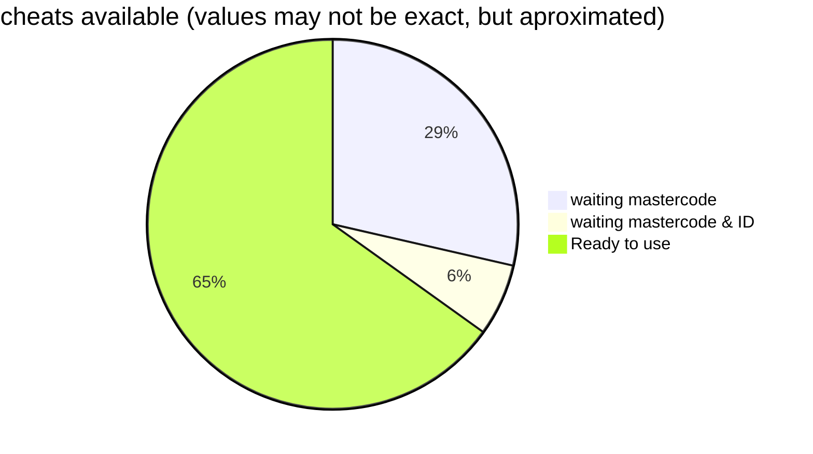

# pnach-DB

Repository meant for storing the widescreen patches package of PCSX2

From here, codes will be converted and set to await for a master code to be provided, before pushing to the master repository

.pnach files that have the ELF ID (ie: `SLES_1234.56`) are awaiting mastercodes

.pnach files named as `12345abc` or anything similar are awaiting both mastercode and ELF ID (tip: that random string of hex digits is the ELF CRC Value of the game they were made for)

